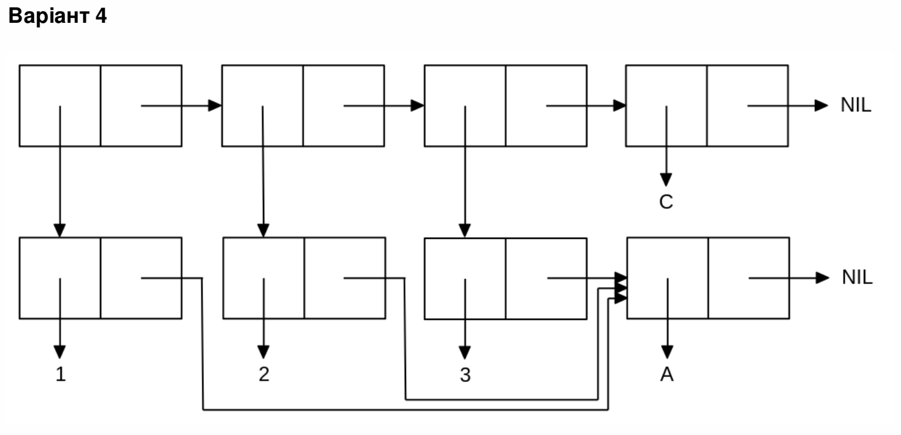

<p align="center"><b>МОНУ НТУУ КПІ ім. Ігоря Сікорського ФПМ СПіСКС</b></p>
<p align="center">
<b>Звіт з лабораторної роботи 1</b>
<p align="center">
<br>"Обробка списків з використанням базових функцій"</br>
з дисципліни "Вступ до функціонального програмування"
</p>

<div style="display: flex; justify-content: flex-end;">
  <div style="border: 0px; padding: 10px;">
    <p>Студент: Чоловенко Дмитро Володимирович</p>
    <p>Група: КВ-13</p>
    <p>Рік: 2024</p>
  </div>
</div>


## Загальне завдання
1. Створіть список з п'яти елементів, використовуючи функції LIST і CONS . Форма створення списку має бути одна — використання SET чи SETQ (або інших допоміжних форм) для збереження проміжних значень не допускається. Загальна кількість елементів (включно з підсписками та їх елементами) не має перевищувати 10-12 шт. (дуже великий список робити не потрібно). Збережіть створений список у якусь змінну з SET або SETQ . Список має містити (напряму або у підсписках): 
* хоча б один символ 
* хоча б одне число 
* хоча б один не пустий підсписок
* хоча б один пустий підсписок 
2. Отримайте голову списку. 
3. Отримайте хвіст списку. 
4. Отримайте третій елемент списку. 
5. Отримайте останній елемент списку. 
6. Використайте предикати ATOM та LISTP на різних елементах списку (по 2-3 приклади для кожної функції). 
7. Використайте на елементах списку 2-3 інших предикати з розглянутих у розділі 4 навчального посібника. 
8. Об'єднайте створений список з одним із його непустих підсписків. Для цього використайте функцію APPEND. 


```lisp
(defvar main_list(cons 'A (cons 1 (cons 'B (cons (list 'C 2) (cons (list `D 3 `4) (list nil)))))))
(format t "Exercise#1, printing main_list")
(print main_list)

(format t "~%Exercise#2 <car>")
(print (car main_list))

(format t "~%Exercise#3 <cdr>")
(print (cdr main_list))

(format t "~%Exercise#4 <nth n x>")
(print (nth 2 main_list))

(format t "~%Exercise#5 <last>")
(print (last main_list))

(format t "~%Exercise#6.1 <ATOM>")
(print (atom (nth 2 main_list)))
(format t "~%Exercise#6.2 <ATOM>")
(print (atom (nth 2 main_list)))

(format t "~%Exercise#6.3 <LISTP>")
(print (listp (nth 2 main_list)))
(format t "~%Exercise#6.4 <LISTP>")
(print (listp (nth 3 main_list)))

(format t "~%Exercise#7.1 <NUMBERP>")
(print (numberp (nth 1 main_list)))
(format t "~%Exercise#7.2 <NUMBERP>")
(print (numberp (car main_list)))
(format t "~%Exercise#7.3 <EQUAL>")
(print (equal (car main_list) `A))
(format t "~%Exercise#7.4 <EQUAL>")
(print (equal (nth 3 main_list) (list 'c 2)))

(format t "~%Exercise#8 <APPEND>")
(print (append main_list (nth 4 main_list)))
```
## Завдання за варіантом №4(20)
Створіть список, що відповідає структурі списку, наведеній на рисунку (за варіантом). Для цього допускається використання не більше двох форм. Номер варіанту обирається як номер у списку групи, який надсилає викладач на початку семестру (на випадок, якщо протягом семестру стануться зміни в складі групи), за модулем 8: 1 -> 1, 2 - > 2, ..., 9 -> 1, 10 -> 2, ... 
Примітка: на рисунках однакові імена символів можуть бути позначені в кількох місцях, проте, загалом, вони позначають один і той самий символ. 
<p align="center">

</p>

```lisp
(format t "~%Tasks by option#4")
(defvar variant-symbol 'a )
(defvar variant-list(list (list 1 variant-symbol) (list 2 variant-symbol) (list 3 variant-symbol) 'c))
(print variant-list)
```

## Результат виконання програми
```
Exercise#1, printing main_list
(A 1 B (C 2) (D 3 4) NIL) 
Exercise#2 <car>
A 
Exercise#3 <cdr>
(1 B (C 2) (D 3 4) NIL) 
Exercise#4 <nth n x>
B 
Exercise#5 <last>
(NIL) 
Exercise#6.1 <ATOM>
T 
Exercise#6.2 <ATOM>
T 
Exercise#6.3 <LISTP>
NIL 
Exercise#6.4 <LISTP>
T 
Exercise#7.1 <NUMBERP>
T 
Exercise#7.2 <NUMBERP>
NIL 
Exercise#7.3 <EQUAL>
T 
Exercise#7.4 <EQUAL>
T 
Exercise#8 <APPEND>
(A 1 B (C 2) (D 3 4) NIL D 3 4) 
Tasks by option#4
((1 A) (2 A) (3 A) C) 
```
